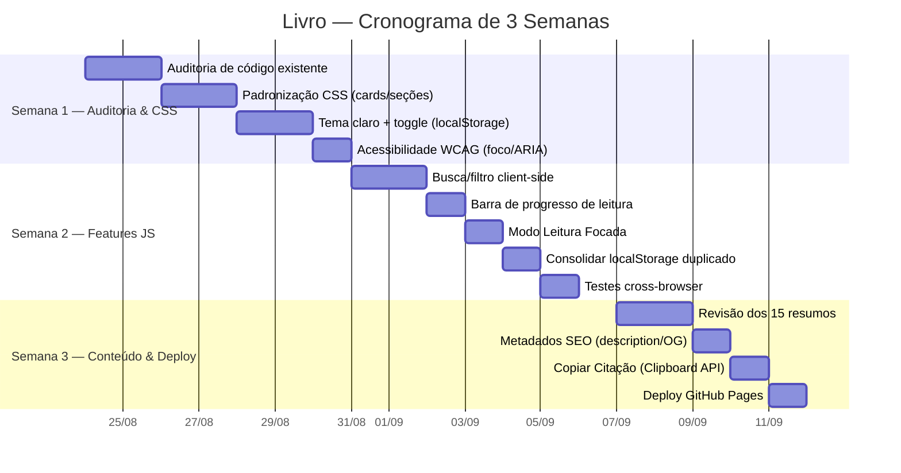

# Cronograma Detalhado (Gantt Simplificado)

3 semanas, 1 sprint por semana. Sem backend, sem banco de dados — só
front-end leve.

## Gantt (Mermaid)

## Resumo por Semana

### Semana 1 — Auditoria de código existente e padronização CSS
- Auditar `books.js`, `livro.js`, `app.js`, `styles.css`.
- Normalizar classes de card/seção para os 15 livros.
- Implementar tema claro + toggle persistido (Sprint 1).
- WCAG: foco visível, ARIA nos controles, contraste AA.

### Semana 2 — Features JS (busca/filtro) e testes cross-browser
- Busca/filtro sobre `LIVRO_BOOKS` (Sprint 2).
- Barra de progresso + Modo Leitura Focada.
- Consolidar duplicação de `localStorage` entre `app.js`/`livro.js`.
- Validar em Chrome/Firefox/Edge/Safari (desktop + mobile).

### Semana 3 — Revisão de conteúdo dos 15 resumos e otimização final
- Revisão de consistência dos 15 resumos.
- Meta tags SEO + Open Graph.
- "Copiar Citação".
- Deploy em GitHub Pages (branch `master`, root).

## Recursos
- **Pessoal:** 1 dev front-end (vanilla).
- **Infra:** nenhuma — GitHub Pages (gratuito) + `localStorage` do navegador.
- **Ferramentas:** editor, `python -m http.server`, extensão de contraste/ARIA.
- **Fora de escopo:** backend, DB, pipelines de build.
