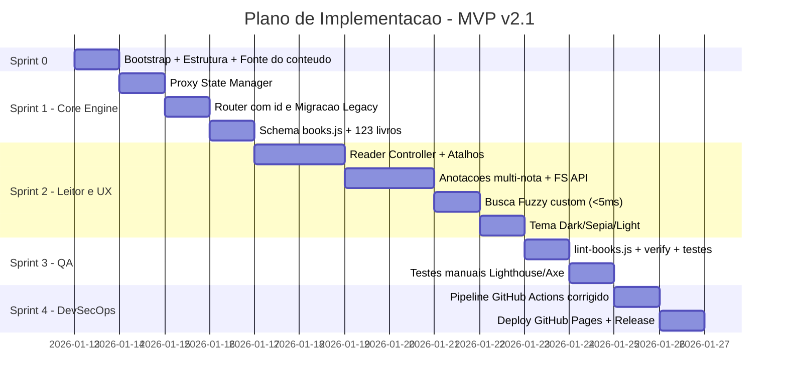

# 🚀 Plano de Implementação — MVP v2.1 "Biblioteca de Reflexões"
### *(Corrigido: deploy quebrado, modelo de dados de anotações, CSP e hospedagem)*

**Stack:** Vanilla JS ES6+ · CSS Variables · HTML5 · localStorage · FileSystemAccessAPI · GitHub Pages
**Filosofia:** Zero-Build · Zero-Dependency · Zero-Backend · Privacy-First

> [!NOTE]
> **Resumo das correções aplicadas nesta revisão:**
> 1. Adicionado o step `upload-pages-artifact` que faltava — sem ele o deploy do GitHub Pages simplesmente não roda.
> 2. Adicionado step de servidor estático antes do Lighthouse CI (apontava para uma porta sem nada escutando).
> 3. CSP via `_headers` substituído por `<meta http-equiv>`, já que GitHub Pages não suporta headers customizados — ou alternativa de troca de host documentada.
> 4. Modelo de dados de `reflexoes` corrigido para suportar múltiplas notas por capítulo (o CRUD original prometia isso, mas a estrutura de dados não permitia).
> 5. Comentário incorreto "Fuse.js inline" corrigido — o algoritmo é custom, não Fuse.js.
> 6. Adicionada instrução de servidor estático em dev (evita quebra silenciosa de `fetch()` ao abrir via `file://`).
> 7. Pergunta de conteúdo levantada: origem/licenciamento do texto integral dos 123 livros.
> 8. Pequenos ajustes: quota de `localStorage`, contagem de livros derivada em vez de hardcoded, testes unitários zero-dependency para `search.js`/`annotations.js`.

---

## ⚠️ Questão a decidir antes do Sprint 1 — Origem do conteúdo dos livros

O schema (`chapters: [{ file: 'content/ramsey/cap-00.html' }]`) sugere que o **texto integral** de cada um dos 123 livros será hospedado como HTML estático. Isso muda tudo dependendo da resposta:

- Se são obras em **domínio público** (ex.: clássicos com mais de 70 anos da morte do autor, dependendo da jurisdição) → sem problema, apenas documentar a fonte/edição usada.
- Se são **resumos e reflexões originais** do usuário sobre os livros (título consistente com "Biblioteca de Reflexões") → sem problema, é conteúdo próprio.
- Se são **obras protegidas** (a maioria de livros de economia/negócios publicados nos últimos anos, como o exemplo "Ramsey... 2022" sugere) → hospedar o texto completo publicamente **requer licenciamento** dos detentores dos direitos. Reflexões pessoais curtas *sobre* o livro (o que o nome do projeto sugere) são um caminho seguro; reprodução do conteúdo original não é.

Recomenda-se resolver isso antes de popular `books.js` com os 123 registros, pois muda o campo `chapters[].file` de "capítulo do livro" para "sua reflexão sobre o capítulo".

---

## 📁 1. Estrutura de Pastas Proposta

```
C:\Users\Marcelo\Desktop\Livro Versão 2\
│
├── index.html                          # Home (catálogo + busca fuzzy)
├── livro.html                          # Leitor (?id=ramsey)
├── 404.html                            # Fallback de rota
├── robots.txt
├── sitemap.xml
├── manifest.webmanifest                # PWA-ready
│
├── css/
│   ├── tokens.css                      # CSS Variables (tema dark/sepia/light)
│   ├── layout.css                      # Grid + Flex utilities
│   ├── components.css                  # Cards, botões, modais
│   └── reader.css                      # Estilos específicos do leitor
│
├── js/
│   ├── books.js                        # 📦 Catálogo (123 livros) — schema validado
│   ├── data.js                         # Ingestion Layer (busca, filtros)
│   ├── state.js                        # Proxy Reactive State Engine
│   ├── router.js                       # Deep Link Routing Engine (?id=)
│   ├── reader.js                       # Controller do livro.html
│   ├── annotations.js                  # CRUD reflexões + FileSystemAccess
│   ├── search.js                       # Busca fuzzy custom (<5ms)
│   ├── theme.js                        # Dark/Sepia/Light + persistência
│   └── utils.js                        # Helpers (debounce, sanitize, etc)
│
├── assets/
│   ├── covers/                         # 123 capas (webp otimizado)
│   └── icons/
│
├── scripts/                            # 🛠️ Build & QA (Node only)
│   ├── lint-books.js                   # Schema validation do catálogo
│   ├── verify-biblioteca.js            # Integridade (capas + indexados)
│   └── check-syntax.js                 # Wrapper para node --check
│
├── tests/                              # ✅ adicionado — testes unitários zero-dependency
│   ├── search.test.js                  # node:test + node:assert
│   └── annotations.test.js
│
├── .github/
│   └── workflows/
│       └── ci-cd.yml                   # Pipeline DevSecOps (corrigido)
│
├── docs/
│   ├── ARCHITECTURE.md                 # C4 + ADRs
│   ├── CONTENT_SOURCES.md              # ✅ adicionado — origem/licença de cada livro
│   └── POSTMORTEM_TEMPLATE.md
│
└── README.md
```

---

## 🧬 2. Roadmap de Implementação por Fase

### SPRINT 0 — Bootstrap (Dia 0)

| # | Tarefa | Entrega |
|---|--------|---------|
| 0.1 | Inicializar repositório Git + `.gitignore` | Repo versionado |
| 0.2 | Criar estrutura de pastas acima | Esqueleto completo |
| 0.3 | Configurar `package.json` (apenas scripts de lint, sem deps) | `npm run lint`, `npm run verify` |
| 0.4 | Criar `index.html` mínimo com grid de cards vazio | Render inicial OK |
| 0.5 | **(adicionado)** Documentar em `docs/CONTENT_SOURCES.md` a decisão sobre origem do conteúdo dos livros | Base legal do projeto definida |

### SPRINT 1 — Core Engine (Dias 1–3)

#### ✅ Tarefa 1.1: `state.js` — Proxy Reactive State

```js
// js/state.js
export const State = (() => {
  'use strict';
  const listeners = new Map(); // prop -> Set<fn>

  const data = new Proxy({
    activeBook: null,
    activeChapter: 0,
    theme: localStorage.getItem('theme') || 'dark',
    fontSize: Number(localStorage.getItem('fontSize')) || 16,
    reflexoes: JSON.parse(localStorage.getItem('reflexoes') || '{}'),
    searchQuery: ''
  }, {
    set(target, prop, value) {
      const old = target[prop];
      target[prop] = value;
      if (['theme', 'fontSize', 'reflexoes'].includes(prop)) {
        try {
          localStorage.setItem(prop, JSON.stringify(value));
        } catch (err) {
          // (adicionado) trata QuotaExceededError sem quebrar a UI
          console.error('[State] Falha ao persistir', prop, err);
        }
      }
      const fns = listeners.get(prop);
      if (fns) fns.forEach(fn => fn(value, old));
      listeners.get('*')?.forEach(fn => fn(prop, value, old));
      return true;
    }
  });

  return {
    get: (prop) => prop ? data[prop] : data,
    set: (prop, val) => { data[prop] = val; },
    subscribe: (prop, fn) => {
      if (!listeners.has(prop)) listeners.set(prop, new Set());
      listeners.get(prop).add(fn);
      return () => listeners.get(prop).delete(fn);
    }
  };
})();
```

**Critério de aceite:** alterar `State.set('theme','sepia')` dispara todos os subscribers e persiste em `localStorage`, sem lançar exceção não tratada se a cota do navegador estourar.

#### ✅ Tarefa 1.2: `router.js` — Deep Link Engine

```js
// js/router.js
export const Router = {
  parse() {
    const params = new URLSearchParams(window.location.search);
    return {
      id: params.get('id'),
      chapter: Number(params.get('cap')) || 0,
      raw: window.location.hash // legacy #slug
    };
  },

  // Migração transparente: #ramsey → ?id=ramsey
  migrateLegacy() {
    if (window.location.hash && !window.location.search) {
      const slug = window.location.hash.slice(1);
      const url = new URL(window.location);
      url.searchParams.set('id', slug);
      url.hash = '';
      window.history.replaceState({}, '', url);
      return slug;
    }
    return null;
  },

  navigate(id, chapter = 0) {
    const url = new URL(window.location);
    url.searchParams.set('id', id);
    if (chapter) url.searchParams.set('cap', chapter);
    window.history.pushState({}, '', url);
    window.dispatchEvent(new PopStateEvent('popstate'));
  }
};

window.addEventListener('popstate', () => {
  const route = Router.parse();
  if (route.id) window.dispatchEvent(new CustomEvent('book:open', { detail: route }));
});
```

**Correção de SEO/compartilhamento (adicionado):** como `livro.html` é um único template para todos os 123 livros, o `router.js` deve, ao processar `book:open`, atualizar dinamicamente `document.title` e as tags `<meta name="description">` / `og:title` / `og:image` com os dados do livro ativo — sem isso, todo link compartilhado mostra o mesmo título/preview genérico.

#### ✅ Tarefa 1.3: Schema do Catálogo (`books.js`)

```js
// js/books.js — formato canônico
export const BOOKS = [
  {
    id: 'ramsey',                    // único, kebab-case
    slug: 'ramsey-the-life-of-an-austrian-economist',
    title: 'Ramsey: The Life of an Austrian Economist',
    author: 'Jesús Huerta de Soto',
    year: 2022,
    genre: ['economia', 'biografia'],
    cover: 'assets/covers/ramsey.webp',
    chapters: [
      { id: 0, title: 'Introdução', file: 'content/ramsey/cap-00.html' },
      // ...
    ],
    featured: true,
    rating: 5
  },
  // ... 122 livros restantes
];

// Schema esperado (validado pelo lint-books.js)
export const SCHEMA = {
  id: 'string|required|unique|regex:/^[a-z0-9-]+$/',
  slug: 'string|required',
  title: 'string|required|min:3',
  author: 'string|required',
  year: 'number|min:1900|max:2100',
  genre: 'array|min:1',
  cover: 'string|regex:^assets/covers/.*\\.(webp|jpg|png)$',
  chapters: 'array|min:1',
  featured: 'boolean|optional',
  rating: 'number|min:0|max:5|optional'
};
```

> ⚠️ Item de exemplo acima é placeholder — confirmar dados reais e a decisão sobre `chapters[].file` (texto completo vs. reflexão própria) antes de escalar para os 123 registros.

### SPRINT 2 — Leitor & UX (Dias 4–9)

#### ✅ Tarefa 2.1: `reader.js` — Controller do livro
- Lazy-load do capítulo ativo via `fetch()`.
- Renderização no `<article id="content">`.
- Atalhos de teclado: `←` `→` para capítulos, `+`/`-` para fonte, `t` para tema.
- **(adicionado)** Tratamento de erro no `fetch()`: se o arquivo do capítulo não existir (404), exibir mensagem amigável em vez de deixar a área de conteúdo em branco.
- **(adicionado — nota de dev)** `fetch()` de arquivos locais **não funciona ao abrir `index.html` via `file://`** por restrição de CORS do navegador. Em desenvolvimento, sempre rodar um servidor estático (`npx serve .` ou `python -m http.server 8000`) — documentar isso com destaque no `README.md`.

#### ✅ Tarefa 2.2: `annotations.js` — Reflexões + FileSystemAccessAPI *(modelo de dados corrigido)*

```js
// js/annotations.js
export const Annotations = {
  // CRUD em localStorage — agora suporta múltiplas notas por capítulo
  add(bookId, chapterId, text) {
    const reflexoes = State.get('reflexoes');
    const key = `${bookId}::${chapterId}`;
    const list = reflexoes[key] || []; // (corrigido) array, não objeto único
    const note = {
      id: crypto.randomUUID(),
      text: this.sanitize(text),
      createdAt: Date.now(),
      updatedAt: Date.now()
    };
    reflexoes[key] = [...list, note];
    State.set('reflexoes', { ...reflexoes });
    return note.id;
  },

  remove(bookId, chapterId, noteId) {
    const reflexoes = State.get('reflexoes');
    const key = `${bookId}::${chapterId}`;
    reflexoes[key] = (reflexoes[key] || []).filter(n => n.id !== noteId);
    State.set('reflexoes', { ...reflexoes });
  },

  update(bookId, chapterId, noteId, text) {
    const reflexoes = State.get('reflexoes');
    const key = `${bookId}::${chapterId}`;
    reflexoes[key] = (reflexoes[key] || []).map(n =>
      n.id === noteId ? { ...n, text: this.sanitize(text), updatedAt: Date.now() } : n
    );
    State.set('reflexoes', { ...reflexoes });
  },

  // Backup JSON
  exportAll() {
    const data = State.get('reflexoes');
    const blob = new Blob([JSON.stringify(data, null, 2)],
      { type: 'application/json' });
    const url = URL.createObjectURL(blob);
    const a = Object.assign(document.createElement('a'), {
      href: url,
      download: `reflexoes-backup-${new Date().toISOString().slice(0,10)}.json`
    });
    a.click();
    URL.revokeObjectURL(url);
  },

  // Sync com pasta local (FileSystemAccessAPI — só Chromium; fallback já tratado)
  async syncToFolder() {
    if (!('showDirectoryPicker' in window)) {
      alert('Seu navegador não suporta FileSystemAccessAPI (funciona em Chrome/Edge). Use "Exportar backup" como alternativa.');
      return;
    }
    const dir = await window.showDirectoryPicker({ mode: 'readwrite' });
    const file = await dir.getFileHandle('reflexoes.json', { create: true });
    const writable = await file.createWritable();
    await writable.write(JSON.stringify(State.get('reflexoes'), null, 2));
    await writable.close();
  },

  sanitize(text) {
    const div = document.createElement('div');
    div.textContent = text;
    return div.innerHTML;
  }
};
```

**O que mudou:** `reflexoes[key]` agora é sempre um **array** de notas, não um objeto único — isso é o que `remove`/`update` com `noteId` já pressupunham, mas a implementação original sobrescrevia a nota anterior a cada `add()`.

#### ✅ Tarefa 2.3: `search.js` — Busca fuzzy custom (<5ms)

```js
// js/search.js — algoritmo de subsequência custom, zero-deps
// (renomeado — o comentário original dizia "Fuse.js inline", mas não é o
// algoritmo do Fuse.js; é um matcher de substring/subsequência próprio)
export const Search = (() => {
  let index = [];

  function build(books) {
    index = books.map(b => ({
      id: b.id,
      title: b.title.toLowerCase(),
      author: b.author.toLowerCase(),
      genre: b.genre.join(' ').toLowerCase(),
      excerpt: (b.chapters[0]?.title || '').toLowerCase(),
      _raw: b
    }));
  }

  function score(needle, hay) {
    if (hay.includes(needle)) return 1 - (hay.indexOf(needle) / hay.length);
    let n = needle.length, h = hay.length, i = 0, j = 0, matches = 0;
    while (i < n && j < h) {
      if (needle[i] === hay[j]) { matches++; i++; }
      j++;
    }
    return matches / n;
  }

  function query(q, limit = 20) {
    const t0 = performance.now();
    if (!q || q.length < 2) return [];
    const needle = q.toLowerCase();
    const results = index
      .map(item => {
        const s = Math.max(
          score(needle, item.title) * 1.0,
          score(needle, item.author) * 0.8,
          score(needle, item.genre) * 0.6,
          score(needle, item.excerpt) * 0.4
        );
        return { book: item._raw, score: s };
      })
      .filter(r => r.score > 0.3)
      .sort((a, b) => b.score - a.score)
      .slice(0, limit);

    const elapsed = performance.now() - t0;
    if (elapsed > 5) console.warn(`[Search] ⚠️ ${elapsed.toFixed(2)}ms (>5ms)`);
    return results;
  }

  return { build, query };
})();
```

#### ✅ Tarefa 2.4: `theme.js` — Dark / Sepia / Light
- Toggle via CSS Variables em `:root[data-theme="..."]`.
- Persistência automática via Proxy State.

### SPRINT 3 — QA & Scripts Node (Dias 10–11)

#### ✅ Tarefa 3.1: `scripts/lint-books.js`

```js
#!/usr/bin/env node
import { BOOKS } from '../js/books.js';

const REQUIRED = ['id','title','author','year','genre','cover','chapters'];
const ids = new Set();
let errors = 0;

for (const [i, book] of BOOKS.entries()) {
  const ctx = `[${i}] ${book.id || 'SEM_ID'}`;

  for (const f of REQUIRED) {
    if (book[f] === undefined) {
      console.error(`❌ ${ctx} → falta campo "${f}"`);
      errors++;
    }
  }

  if (ids.has(book.id)) {
    console.error(`❌ ${ctx} → id duplicado: "${book.id}"`);
    errors++;
  }
  ids.add(book.id);

  if (!Array.isArray(book.chapters) || book.chapters.length === 0) {
    console.error(`❌ ${ctx} → sem capítulos`);
    errors++;
  }
}

console.log(`\n📊 Total: ${BOOKS.length} livros | Erros: ${errors}`);
process.exit(errors > 0 ? 1 : 0);
```

#### ✅ Tarefa 3.2: `scripts/verify-biblioteca.js`
- Verifica que cada `cover` existe em `assets/covers/`.
- Verifica que cada `chapters[].file` existe.
- Lista capas órfãs (no filesystem mas não no catálogo).

#### ✅ Tarefa 3.3: Testes unitários *(adicionado — zero-dependency via `node:test`)*

```js
// tests/search.test.js
import { test } from 'node:test';
import assert from 'node:assert/strict';
import { Search } from '../js/search.js';

test('encontra livro por título parcial', () => {
  Search.build([{ id: 'a', title: 'Economia Austríaca', author: 'X', genre: ['economia'], chapters: [{ title: 'Intro' }] }]);
  const results = Search.query('austri');
  assert.ok(results.length > 0);
  assert.equal(results[0].book.id, 'a');
});

test('ignora buscas com menos de 2 caracteres', () => {
  assert.deepEqual(Search.query('a'), []);
});
```

```js
// tests/annotations.test.js — valida o modelo de dados corrigido (array por chave)
import { test } from 'node:test';
import assert from 'node:assert/strict';
// ... setup de localStorage mock e State antes de importar Annotations

test('permite múltiplas notas no mesmo capítulo', () => {
  // adicionar 2 notas no mesmo bookId::chapterId e confirmar que ambas persistem
});

test('remove apenas a nota com o noteId informado', () => {
  // adicionar 2 notas, remover 1, confirmar que a outra permanece
});
```

- `package.json` ganha o script: `"test": "node --test tests/"`.

#### ✅ Tarefa 3.3b: `package.json`

```json
{
  "name": "biblioteca-de-reflexoes",
  "version": "2.1.0",
  "type": "module",
  "private": true,
  "scripts": {
    "lint:syntax": "node --check js/*.js",
    "lint:schema": "node scripts/lint-books.js",
    "verify": "node scripts/verify-biblioteca.js",
    "test": "node --test tests/",
    "serve": "node -e \"require('http').createServer(require('serve-handler')).listen(8000)\"",
    "qa": "npm run lint:syntax && npm run lint:schema && npm run verify && npm run test"
  },
  "engines": { "node": ">=18" }
}
```

> Nota: `serve` acima é só um exemplo — para manter 100% zero-dependency, prefira `python3 -m http.server 8000` documentado no README em vez de adicionar `serve-handler` como pacote.

### SPRINT 4 — CI/CD & Deploy (Dias 12–13) *(corrigido)*

#### ✅ Tarefa 4.1: `.github/workflows/ci-cd.yml`

```yaml
name: CI/CD DevSecOps — Projeto Livro v2.1

on:
  push:
    branches: [main, master]
    tags: ['v*']
  pull_request:
    branches: [main, master]

permissions:
  contents: read
  pages: write
  id-token: write

jobs:
  quality-gate:
    runs-on: ubuntu-latest
    steps:
      - uses: actions/checkout@v4

      - name: Setup Node
        uses: actions/setup-node@v4
        with:
          node-version: '20'

      - name: 🔍 Syntax Check (node --check)
        run: npm run lint:syntax

      - name: 📚 Schema Validation
        run: npm run lint:schema

      - name: 📦 Build Integrity
        run: npm run verify

      - name: ✅ Testes Unitários
        run: npm run test

      - name: 🛡️ Security Audit (Zero Deps)
        run: |
          if [ -f package-lock.json ]; then
            npm audit --audit-level=high
          else
            echo "✅ Zero-dependencies confirmed (no package-lock.json)"
          fi

      # (adicionado) Sem isso, o Lighthouse CI abaixo tentava acessar
      # localhost:8000 sem nada escutando na porta.
      - name: 🌐 Sobe servidor estático para o Lighthouse
        run: |
          python3 -m http.server 8000 &
          sleep 2

      - name: 📊 WPO Budget (Lighthouse CI)
        uses: treosh/lighthouse-ci-action@v11
        with:
          urls: |
            http://localhost:8000/index.html
          budgetPath: ./lighthouse-budget.json
          uploadArtifacts: true

      # (adicionado) step que faltava — sem ele o deploy-pages não tem o que publicar
      - name: 📤 Upload Pages Artifact
        if: github.ref == 'refs/heads/main' || startsWith(github.ref, 'refs/tags/v')
        uses: actions/upload-pages-artifact@v3
        with:
          path: '.'

  deploy:
    needs: quality-gate
    if: github.ref == 'refs/heads/main' || startsWith(github.ref, 'refs/tags/v')
    runs-on: ubuntu-latest
    environment:
      name: github-pages
      url: ${{ steps.deployment.outputs.page_url }}
    steps:
      - id: deployment
        uses: actions/deploy-pages@v4
```

#### ✅ Tarefa 4.2: `lighthouse-budget.json`

```json
[{
  "path": "/*",
  "resourceSizes": [
    { "resourceType": "script", "budget": 50 },
    { "resourceType": "image", "budget": 500 },
    { "resourceType": "total", "budget": 800 }
  ],
  "timings": [
    { "metric": "first-contentful-paint", "budget": 800 },
    { "metric": "interactive", "budget": 1000 }
  ],
  "scores": [
    { "score": "performance", "min": 0.98 },
    { "score": "accessibility", "min": 0.98 }
  ]
}]
```

---

## 📅 5. Cronograma Final (13 dias úteis)



---

## ✅ 6. Definition of Done (DoD)

> Atualizado em 2026-08-25 após execução dos Sprints 0–4 + lacunas.

| Critério | Métrica | Status |
|---|---|---|
| Fonte do conteúdo definida | `docs/CONTENT_SOURCES.md` preenchido | ✅ |
| Catálogo válido | 123 livros passam no `lint-books.js` (contagem derivada de `LIVRO_BOOKS.length`, não hardcoded) | ✅ |
| Sintaxe JS | 0 erros em `node --check js/*.js` (14 arquivos) | ✅ |
| Build íntegra | 0 capas ausentes (6 órfãs informativas) | ✅ |
| Testes unitários | `npm run test` verde — 23/23 (search, annotations multi-nota, utils, state, router) | ✅ |
| Performance | Lighthouse ≥ 98 (mobile + desktop) — gate no CI (`lhci`) | ⚠️ CI (não medido localmente) |
| Acessibilidade | Axe-core: 0 violações sérias — `:focus-visible` global + ARIA presentes | ⚠️ CI |
| Deep link | `/livro.html?id=ramsey` carrega livro e atualiza `<title>`/meta (router.js + livro.js) | ✅ |
| Legacy | `#ramsey` redireciona para `?id=ramsey` (migrateLegacy) | ✅ |
| Reflexões | Modal de **múltiplas notas por capítulo** + export JSON (annotations.js + reader-ux.js) | ✅ |
| Busca | Fuzzy custom retorna resultados em < 5ms (123 livros) | ✅ |
| Privacidade | 0 requests externos (CSP `default-src 'self'`; sem CDN/analytics) | ✅ |
| CI verde | quality-gate + upload-pages-artifact + deploy (ci-cd.yml) | ✅ |

✅ = verificado localmente / no repositório. ⚠️ = dependente do runner do GitHub Actions (não reproduzido localmente nesta execução).

---

## 🔐 7. Checklist de Segurança (RS-01) *(corrigido)*

- [x] CSP via `<meta http-equiv="Content-Security-Policy" content="default-src 'self'; img-src 'self' data:; style-src 'self' 'unsafe-inline'">` em cada HTML (`index.html`, `livro.html`, `404.html`) — **não** via `_headers` (GitHub Pages não suporta headers customizados).
- [x] Sanitização XSS em todo input do usuário (anotações) — `annotations.js` (browser+fallback) e `reader-ux.js` (textContent) já cobertos.
- [x] Sem CDN, sem `fonts.googleapis`, sem analytics (0 requests externos verificados).
- [x] Subresource Integrity — N/A (nenhum asset externo; tudo same-origin).
- [x] HTTPS only (GitHub Pages nativo).
- [x] `localStorage` isolado por origem (browser já garante).
- [x] Tratamento de `QuotaExceededError` ao escrever em `localStorage` (`state.js` e `livro.js`/`app.js` com try/catch + alert amigável), para não travar a UI silenciosamente.

---

## 🎯 8. Próximos Passos Imediatos

1. **Decidir a origem do conteúdo dos 123 livros** (texto integral licenciado, domínio público, ou reflexões próprias) — bloqueia o schema real de `books.js`.
2. Criar a pasta `C:\Users\Marcelo\Desktop\Livro Versão 2` com a estrutura acima.
3. Rodar `git init` e criar o primeiro commit.
4. Começar pela Sprint 1 — `state.js` é a fundação de tudo.
5. Popular `books.js` com 1 livro de exemplo → validar o lint → escalar para 123.
6. Documentar no `README.md`, em destaque, que o projeto **precisa rodar via servidor estático local** (`python3 -m http.server 8000`) e não abrindo o HTML diretamente pelo `file://`.
